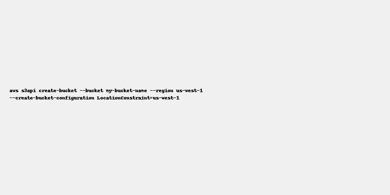

# Creating an S3 Bucket in AWS using AWS CLI

This guide demonstrates how to create an S3 bucket using the AWS Command Line Interface (CLI).

---

## 🛠️ Prerequisites

- AWS CLI installed and configured with valid credentials.
- Required permissions to create an S3 bucket.

---

## 📦 Create S3 Bucket Command

```bash
aws s3api create-bucket --bucket my-bucket-name --region us-west-1 --create-bucket-configuration LocationConstraint=us-west-1
```

### Explanation:
- `aws s3api create-bucket`: Command to create a new S3 bucket.
- `--bucket my-bucket-name`: Replace `my-bucket-name` with your desired unique bucket name.
- `--region us-west-1`: Region in which to create the bucket.
- `--create-bucket-configuration LocationConstraint=us-west-1`: Required for some AWS regions.

---

## 📷 Screenshot Example

> You can take a screenshot of your terminal after running the above command and include it here.



---

## ✅ Result

You should see a JSON output confirming that your bucket was successfully created.

```json
{
  "Location": "/my-bucket-name"
}
```

